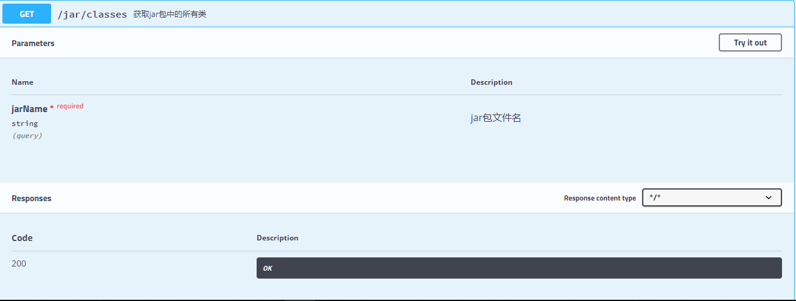

# Getting Started

## TO-DO

- 前端？
- 考虑方法参数或返回值不是基本类型？
- 考虑用流式方法处理大型excel文件？
- 处理测试用例抛出异常的情况？
- 记录jar文件各版本的测试信息？
- 考虑卸载长时间不用的jar？

## API介绍

### 文件上传

- 上传jar文件

- 上传excel文件

### jar包内容获取

- 获取某个jar包的所有类

- 获取某个类的所有方法

### 运行测试数据

